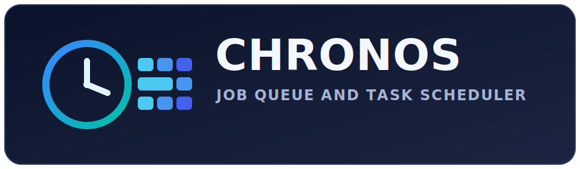

<p align="center">
  
</p>

<p align="center">
  
  
  
  
  
  
  
</p>

# Chronos : Job Queue and Task Scheduler

A deep-dive design for a high-performance async job system in Rust.

Status: Design-first. This repository is currently scaffolded, and this document defines the target system behavior before full implementation.

## What Is It?

Chronos is a backend service that lets any application offload slow or heavy work to background workers.

Instead of making users wait for tasks like email delivery, PDF generation, image processing, or report building, the app submits a job and receives a job ID immediately. Chronos schedules and executes that job asynchronously with retries, priority handling, and status tracking.

You can think of Chronos as a self-hosted Sidekiq or Celery style platform, built in Rust for speed, reliability, and control.

## What Does It Produce?

| Output           | Description                                                        |
| ---------------- | ------------------------------------------------------------------ |
| REST API         | HTTP endpoints to submit, inspect, list, retry, and cancel jobs    |
| Job Results      | Stored result or error output for each completed attempt           |
| Webhooks         | Optional POST callback to producer apps when jobs complete or fail |
| Admin API        | Endpoints for queue health, workers, throughput, retries, and DLQ  |
| Logs and Metrics | Structured JSON logs and Prometheus metrics endpoint               |

## Core Concepts

Producer -> Job Queue -> Worker Pool -> Result Store

- Producer: Any service that submits jobs over HTTP.
- Job: A unit of work containing type, payload, priority, schedule, and retry policy.
- Queue: Ordered pending jobs, priority-aware and schedule-aware.
- Worker: Async runtime task that claims and executes jobs.
- Result Store: Durable persistence of status, attempts, outputs, errors, and timings.

## High-Level Architecture

```text
Producer Apps
    |
    v
Chronos API (Actix Web)
    |
    v
Queue Layer (Redis or DB-backed scheduling queue)
    |
    v
Worker Pool (Tokio tasks)
    |
    v
PostgreSQL Result Store
```

## Job Lifecycle

```text
pending -> running -> completed
   |         |
   |         -> retrying -> running (next attempt)
   |
   -> canceled
   -> failed (max retries exhausted)
```

Recommended status values:

- pending
- running
- retrying
- completed
- failed
- canceled

## Full Workflow

### Step 1 - Producer Submits a Job

Request:

```http
POST /jobs
Content-Type: application/json
```

```json
{
  "type": "send_email",
  "payload": { "to": "user@example.com", "template": "welcome" },
  "priority": "high",
  "run_at": null,
  "max_retries": 3,
  "webhook_url": "https://myapp.com/hooks/job-done"
}
```

Behavior:

- Server validates payload and job type.
- Server assigns a unique job_id.
- Status is set to pending.
- Job is inserted into queue.
- API returns an accepted response with job metadata.

### Step 2 - Scheduler Selects the Next Job

Scheduler loop runs every few milliseconds and evaluates:

- Are there idle workers?
- Are there pending jobs with run_at <= now?
- Which job has the highest effective priority?

Then it:

- Claims one eligible job.
- Marks it running.
- Dispatches it to an available worker.

### Step 3 - Worker Executes the Job Handler

Each worker:

- Loads job payload.
- Resolves the registered handler by job type.
- Executes the handler async.
- Captures output, duration, and errors.

Handler registration at startup:

```rust
scheduler.register("send_email", handle_send_email);
scheduler.register("generate_pdf", handle_generate_pdf);
scheduler.register("resize_image", handle_resize_image);
```

### Step 4 - Success or Failure Path

On success:

- Status changes to completed.
- Result payload is persisted.
- Completion metadata is recorded.
- Optional webhook is fired.

On failure:

- Attempts are incremented.
- Status changes to retrying while backoff is scheduled.
- Exponential backoff is applied (example: 5s -> 25s -> 125s).
- After max_retries is exhausted, status changes to failed and job is moved to DLQ.

### Step 5 - Producer Queries Job Status

```http
GET /jobs/{job_id}
```

```json
{
  "id": "job_abc123",
  "type": "send_email",
  "status": "completed",
  "result": { "message_id": "msg_xyz" },
  "duration_ms": 340,
  "attempts": 1,
  "created_at": "2026-04-02T10:30:00Z",
  "completed_at": "2026-04-02T10:30:00Z"
}
```

## API Surface (Planned)

| Method | Endpoint              | Description                                          |
| ------ | --------------------- | ---------------------------------------------------- |
| POST   | /jobs                 | Submit a new job                                     |
| GET    | /jobs/{id}            | Get status, attempts, output, and error details      |
| DELETE | /jobs/{id}            | Cancel a pending or scheduled job                    |
| GET    | /jobs                 | List and filter jobs by status, type, time, priority |
| POST   | /jobs/{id}/retry      | Force retry for failed jobs                          |
| GET    | /queues               | Queue-level stats and backlog metrics                |
| POST   | /queues/{name}/pause  | Pause queue dispatching                              |
| POST   | /queues/{name}/resume | Resume queue dispatching                             |
| GET    | /workers              | Active workers and current job assignments           |
| GET    | /dlq                  | Dead Letter Queue contents                           |
| GET    | /metrics              | Prometheus scrape endpoint                           |
| GET    | /health               | Liveness and readiness checks                        |

## Job Contract (Planned)

Required fields:

- type: Handler identifier, for example send_email.
- payload: Arbitrary JSON payload for handler logic.

Optional fields:

- priority: low, normal, high.
- run_at: RFC3339 timestamp, null for immediate execution.
- max_retries: Retry limit for this job.
- webhook_url: Callback endpoint after final state.
- dedupe_key: Optional idempotency key.

## Retry and Backoff Strategy

Default strategy:

- Retry only on retryable errors.
- Exponential backoff with bounded max delay.
- Per-job max_retries override supported.
- Move to DLQ after final failure.

DLQ metadata should include:

- final error class and message
- stack trace or failure details
- total attempts
- first and last attempt timestamps

## Webhook Contract (Planned)

When webhook_url is set, Chronos sends a POST callback on final job state.

Example payload:

```json
{
  "event": "job.completed",
  "job_id": "job_abc123",
  "status": "completed",
  "attempts": 1,
  "duration_ms": 340,
  "result": { "message_id": "msg_xyz" },
  "error": null,
  "timestamp": "2026-04-02T10:30:00Z"
}
```

Recommended webhook safeguards:

- HMAC signature header
- retry delivery on non-2xx
- idempotent consumer handling

## Observability

### Logs

Emit structured JSON logs for:

- job submitted
- job claimed
- job started
- job succeeded
- job failed
- job retried
- webhook delivered or failed

### Metrics

Expose Prometheus metrics, for example:

- chronos_jobs_submitted_total
- chronos_jobs_completed_total
- chronos_jobs_failed_total
- chronos_jobs_retried_total
- chronos_queue_depth
- chronos_job_duration_ms
- chronos_worker_busy_ratio

## Reliability and Concurrency Guarantees

Target guarantees:

- At-least-once execution semantics.
- Idempotent handler design encouraged.
- Atomic state transitions for claim and completion.
- Stale running job recovery via heartbeat or lease timeout.

## Data Model (Planned)

Core job record fields:

- id
- type
- payload_json
- status
- priority
- run_at
- attempts
- max_retries
- last_error
- result_json
- webhook_url
- created_at
- started_at
- completed_at
- updated_at

## Security Considerations

- Validate and bound payload sizes.
- Authenticate producer requests.
- Authorize job read access by tenant or namespace.
- Protect webhook callbacks with signatures.
- Scrub secrets from logs and error payloads.

## Current Repository Layout

This workspace is currently organized as:

```text
backend/
  api/        # HTTP API crate (Actix Web)
  store/      # Persistence crate (Diesel + PostgreSQL)
  doc/        # Architecture notes
```

## Implementation Roadmap

1. Define job schema and database migrations.
2. Build POST /jobs and GET /jobs/{id} endpoints.
3. Implement scheduler loop and worker pool.
4. Add retry, backoff, and DLQ behavior.
5. Add webhook delivery and signature verification.
6. Add metrics, logs, and admin endpoints.
7. Harden with tests, idempotency checks, and load benchmarks.

## Scope and Non-Goals (Initial)

In scope:

- Reliable asynchronous processing
- Priority and delayed jobs
- Retries and DLQ
- Job status tracking
- Observability

Out of scope for first release:

- Cron expression orchestration
- Multi-region active-active replication
- Workflow DAG engine

## Summary

Chronos is designed to be a fast and reliable async execution layer for any application that needs background processing with operational visibility. This README defines the target architecture and behavior so implementation can proceed with clear boundaries and contracts.
